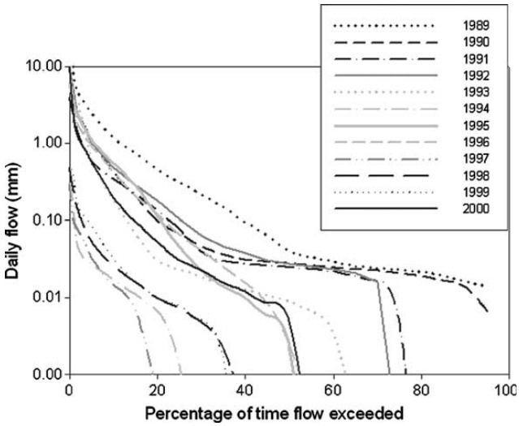
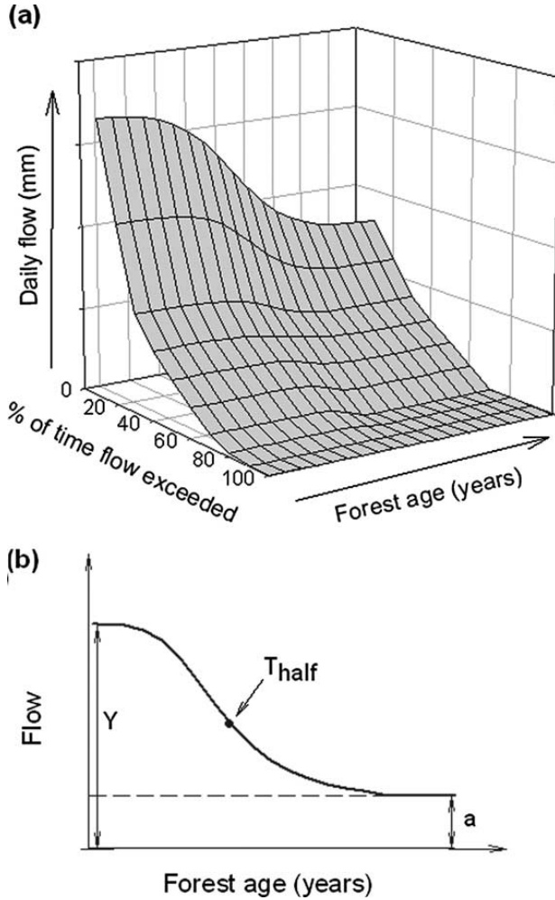
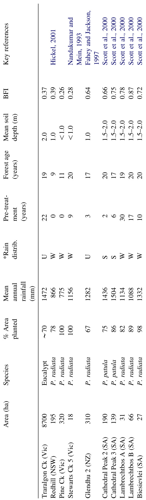
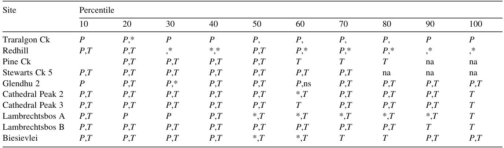
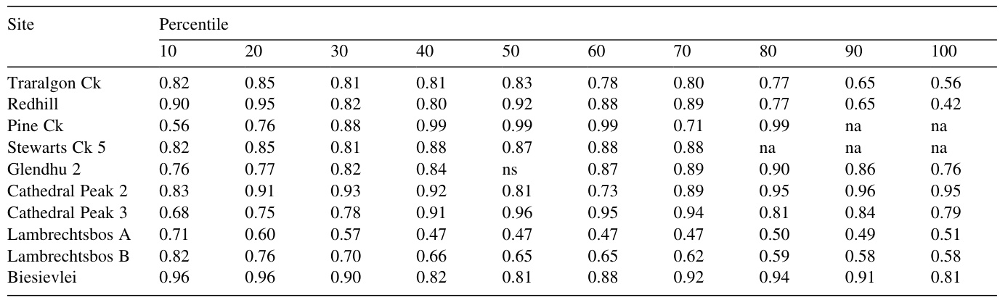
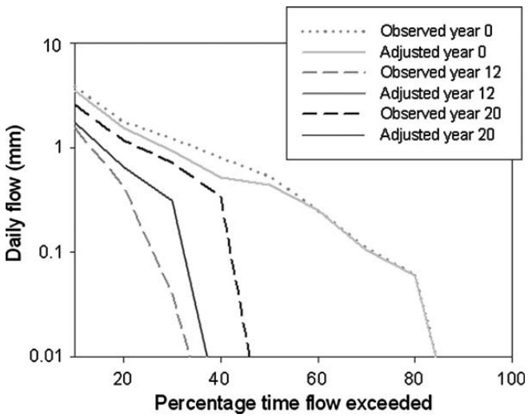
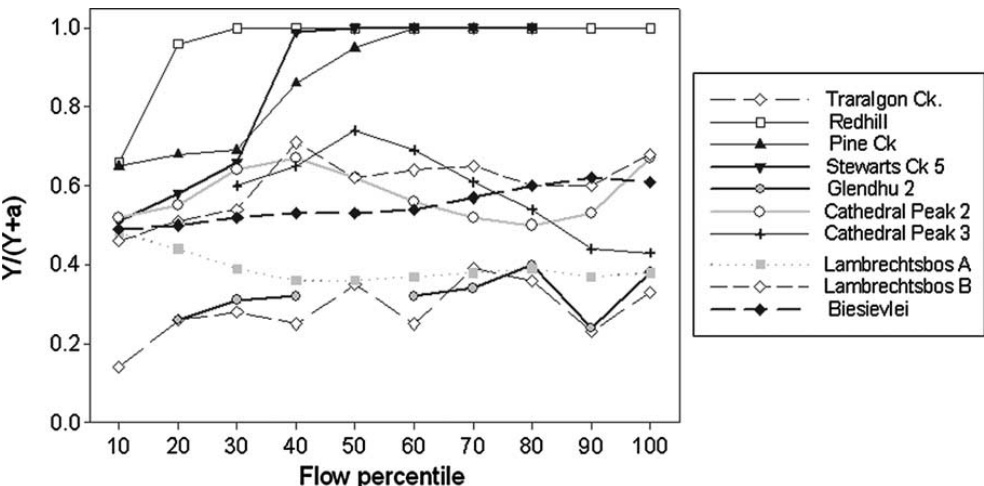
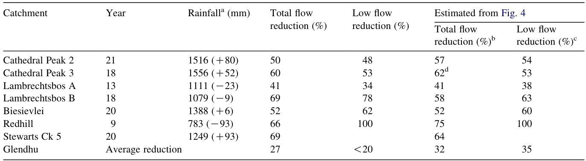
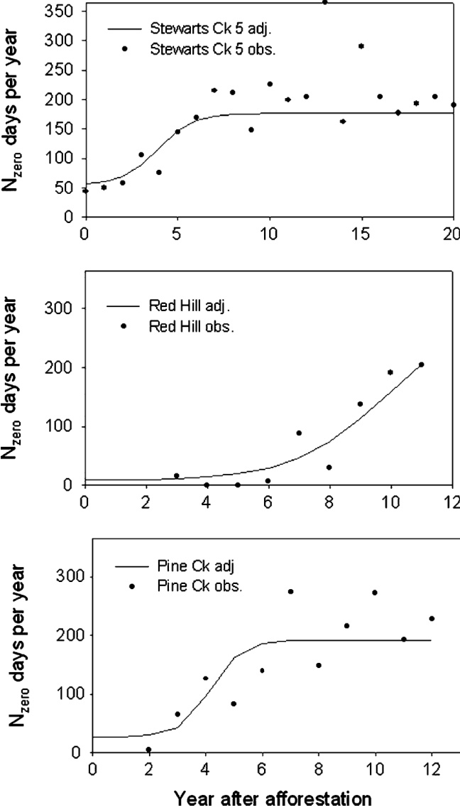

# The response of flow duration curves to afforestation  

Patrick N.J. Lane \* , Alice E. Best , Klaus Hickel , Lu Zhang  

a School of Forest and Ecosystem Studies, University of Melbourne, P.O. Box 137, Heidelberg, Victoria 3084, Australia b CSIRO Division of Land and Water, Canberra, ACT, Australia c Cooperative Research Centre for Catchment Hydrology, Canberra, ACT, Australia d Department of Civil and Environmental Engineering, University of Melbourne, Victoria, Australia  

Received 1 October 2003; revised 22 December 2004; accepted 3 January 2005  

# Abstract  

The hydrologic effect of replacing pasture or other short crops with trees is reasonably well understood on a mean annual basis. The impact on flow regime, as described by the annual flow duration curve (FDC) is less certain. A method to assess the impact of plantation establishment on FDCs was developed. The starting point for the analyses was the assumption that rainfall and vegetation age are the principal drivers of evapotranspiration. A key objective was to remove the variability in the rainfall signal, leaving changes in streamflow solely attributable to the evapotranspiration of the plantation. A method was developed to (1) fit a model to the observed annual time series of FDC percentiles; i.e. 10th percentile for each year of record with annual rainfall and plantation age as parameters, (2) replace the annual rainfall variation with the long term mean to obtain climate adjusted FDCs, and (3) quantify changes in FDC percentiles as plantations age. Data from 10 catchments from Australia, South Africa and New Zealand were used. The model was able to represent flow variation for the majority of percentiles at eight of the 10 catchments, particularly for the 10–50th percentiles. The adjusted FDCs revealed variable patterns in flow reductions with two types of responses (groups) being identified. Group 1 catchments show a substantial increase in the number of zero flow days, with low flows being more affected than high flows. Group 2 catchments show a more uniform reduction in flows across all percentiles. The differences may be partly explained by storage characteristics. The modelled flow reductions were in accord with published results of paired catchment experiments. An additional analysis was performed to characterise the impact of afforestation on the number of zero flow days  $(N_{\mathrm{zero}})$  for the catchments in group 1. This model performed particularly well, and when adjusted for climate, indicated a significant increase in $N_{\mathrm{zero}}$ . The zero flow day method could be used to determine change in the occurrence of any given flow in response to afforestation. The methods used in this study proved satisfactory in removing the rainfall variability, and have added useful insight into the hydrologic impacts of plantation establishment. This approach provides a methodology for understanding catchment response to afforestation, where paired catchment data is not available. $\copyright$  2005 Elsevier B.V. All rights reserved.  

Keywords:  Afforestation; Flow duration curves; Flow reduction; Paired catchments  

# 1. Introduction  

Widespread afforestation through plantation estab- lishment on non-forested land represents a potentially significant alteration of catchment evapotranspiration (ET). Using data collated from multiple catchment studies, researchers have demonstrated a consistent difference in ET between forests and grass or short crops, and the relationship between ET and rainfall on a mean annual basis ( Holmes and Sinclair, 1986; Vertessy and Bessard, 1999; Zhang et al., 1999, 2001 ). Once annual rainfall exceeds  $400–500\;\mathrm{mm}$ , there is an increasing divergence between forest and grassland ET ( Zhang et al., 2001 ). Research from South Africa in particular has demonstrated flow reduction following afforestation with both pine and eucalypt species ( Bosch, 1979; Van Lill et al., 1980; Van Wyk, 1987; Bosch and Von Gadow, 1990; Scott and Smith, 1997; Scott et al., 2000 ). In regions, where water is an increasingly valuable resource, prediction of the long-term hydrologic impact of afforestation is a prerequisite for the optimal planning of catchment land use.  

Zhang et al. (1999, 2001)  developed simple and easily parameterised models to predict changes in mean annual flows following afforestation. However, there is a need to consider the annual flow regime as the relative changes in high and low flows may have considerable site specific and downstream impacts.. Sikka et al. (2003)  recently showed a change from grassland to  Eucalyptus globulus  plantations in India decreased a low flow index by a factor of two during the first rotation (9 years), and by 3.75 during the second rotation, with more subdued impact on peak flows. The index was defined as the 10 day average flow exceeded $95\%$  of the time, obtained from analysis of 10-day flow duration curves.  Scott and Smith (1997)  reported proportionally greater reductions in low flows (75–100th percentiles) than annual flows from South African research catchments under conversions from grass to pine and eucalypt plantations, while  Bosch (1979)  found the greatest reduction in seasonal flow from the summer wet season.  Fahey and Jackson (1997)  reported the reduction in peak flows was twice that of total flow and low flows for pine afforestation in New Zealand. The generalisations that can be drawn from annual analyses, where processes and hydrologic responses are to a certain extent integrated may not  

  
Fig. 1. Annual flow duration curves of daily flows from Pine Creek, Australia, 1989–2000.  

apply on a seasonal or shorter scale. Further, the observed impacts of any land use change on flows may be exaggerated or understated depending on the prevailing climate. Observations of flow during extended wet or dry spells, or with high annual variability can obscure the real impacts.  Fig. 1  plots annual FDCsover 12 years of plantation growth for one of the catchments used in this study, Pine Creek. The net change in flow is obscured by rainfall variability; e.g. the greatest change in the FDC is in 1996, with the stream flowing   $<20\%$  of the time. This may be compared with 2000, where there is substantially higher flows.  

This paper presents the results of a project aimed at quantifying changes in annual flow regime of catchments following plantation establishment. The flow regime is represented by the flow duration curve (FDC). The key assumption was that rainfall and forest age are the principal drivers of evapotranspira- tion. For any generalisation of response of the FDC to vegetation change, the variation in the annual climate signal must be removed. The time-tested solution to this problem is the paired-catchment (control versus treatment) experiment. The benefits in such studies are manifold: unambiguous measures of trends, insights into the processes driving those trends, excellent opportunities for model parameter is ation and validation. However these data are not readily available for the range of treamtments and environ- ments required. Consequently, the aims of this project were to (1) fit a model to the observed annual time series of FDC percentiles; i.e. 10th percentile for each year of record with annual rainfall and plantation age as parameters, (2) replace the annual rainfall variation with the long term mean to obtain climate adjusted FDCs, and (3) quantify changes in FDC percentiles as plantations age. If the climate signal, represented by rainfall, could be successfully removed, the resulting changes in the FDC would be solely attributable to the vegetation.  

# 2. Methods  

# 2.1. Character is ation of flow regime  

Flow duration curves display the relationship between streamflow and the percentage of time the streamflow is exceeded as a cumulative density function They can be constructed for any time period (daily, weekly, monthly, etc.) and provide a graphical and statistical view of historic streamflow variability in a single catchment or a comparison of inter- catchment flow regimes.  Vogel and Fennessey (1994) and  Smakhtin (1999, 2001)  demonstrate the utility (and caveats) of FDCs in characterising, comparing and predicting flow regimes at varying temporal scales.  Fig. 1  is an example of annual FDCs constructed from daily flows. For the consideration of annual flow regime, daily flows are an appropriate time step for FDC construction.  

FDCs were computed from the distribution of daily flows for each year of record based on the appropriate water years (May–April or November–October) for 10 Southern Hemisphere catchments. Each 10th percentile (decile) was extracted from the annual FDCs of each catchment to form the data sets for analysis. For the purpose of characterising changes in each of the deciles, it is assumed that the time series is principally a function of climate and vegetation characteristics. Given rainfall is generally the most important factor affecting streamflow and the most easily accessed data, it is chosen to represent the climate. Catchment physical properties such as soil properties and topography are assumed to be time invariant and therefore their impact on runoff is considered constant throughout the analysis. As trees intercept and transpire at increasing rates until canopy closure, a time term is required to represent plantation growth. A simple model relating the time series of each decile with rainfall and vegetation characteristics can be expressed as:  

$$
\begin{array}{r}{Q_{\%}=f(P)+g(T)}\end{array}
$$  

where $Q_{\mathcal{k}}$  is the percentile flow, $f(P)$  is a function of rainfall and   $g(T)$  is a function of the age of the plantation. Annual rainfall was chosen as the rainfall statistic as it proved to be the most robust predictor of flow over the whole range of flow percentiles, as compared with rainfall percentiles; e.g. median rain- fall versus 10th flow percentile. The use of annual rainfall also minimises parameter complexity. The choice of model form is dependent on selecting a function that describes the relationship between forest age and ET.  Scott and Smith (1997)  demonstrated cumulative reductions in annual and low flows resulting from afforestation fitted a sigmoidal function, similar to forest growth functions. Conse- quently, we used a sigmoidal function to characterise the impact of plantation growth on each flow decile. Fig. 2 a is a schematic of the change in the FDC over time. The model took the form:  

$$
Q_{\mathcal{U}}=a+b(\Delta P)+\frac{Y}{1+\exp\!\left(\frac{T-T_{\mathrm{half}}}{S}\right)}
$$  

where   $Q_{\mathcal{k}}$  is the percentile flow (i.e. $Q_{50}$  is the 50th percentile flow),   $Y$  and   $S$  are coefficients of the sigmoidal term, $\Delta P$  is the deviation of annual rainfall from the period of record average, and $T_{\mathrm{half}}$  is the time in years at which half of the reduction in $Q_{\mathbb{X}}$  due to afforestation has taken place. For the average climate condition   $\Delta P\!=\!0$ , $a$  becomes the value of $Q_{\mathrm{\small{\mathscr{k}}}}$  when the new equilibrium plantation water use under afforestation is reached.  Y  then gives the magnitude of change due to afforestation, and   $S$  describes the shape of the response as shown in  Fig. 2 b. For the average pre-treatment condition   $\Delta P\!=\!0$  at   $T{=}0$ , $Q_{\mathrm{\%}}$  approximately equals $a+Y.$ . Estimation of a pre- afforestation condition would not require the time term. Details of the optimisation scheme and sensitivity tests on initial parameter values are given in  Lane et al. (2003) .  

  
Fig. 2. (a) Schematic of the change in the FDC over time, and (b) definition of model parameters.  

# 2.2. Zero flow day analysis  

A notable feature of  Fig. 1  is the increase in the number of zero flow days. A similar approach to Eq. (2), using an inverse sigmoidal function was employed to assess the impact of afforestation on the number of zero flow days per year  $(N_{\mathrm{zero}})$ . In this case, the left hand side of Eq. (2) is replaced by $N_{\mathrm{zero}}$ , and $b$ and $S$  are constrained to negative as $N_{\mathrm{zero}}$  decreases as rainfall increases, and increases with plantation growth:  

$$
N_{\mathrm{zero}}=a+b(\Delta P)+\frac{Y}{1+\exp\left(\frac{T-T_{\mathrm{half}}}{S}\right)}
$$  

For the average pre-treatment condition   $\Delta P\!=\!0$ and   $T\!\!=\!0,\ N_{\mathrm{zero}}$  approximately equals   $a,~Y$  gives the magnitude of change in zero flow days due to afforestation, and   $S$  describes the shape of the response. For the average climate condition $\Delta P\!=\!0$ , $a+Y$  becomes the number of zero flow days when the new equilibrium condition under afforestation is reached.  

# 2.3. Statistical analyses  

The coefficient of efficiency  $(E)$  ( Nash and Sutcliffe, 1970; Chiew and McMahon, 1993; Legates and McCabe, 1999 ) was used as the ‘goodness of fit’ measure to evaluate the fit between observed and predicted flow deciles (2) and zero flow days (3). $E$  is given by:  

$$
E=1.0-\frac{\sum_{i=1}^{N}(O_{i}-P_{i})^{2}}{\sum_{i=1}^{N}(O_{i}-\bar{O})^{2}}
$$  

where   $o$  are observed data,   $P$  are predicted values, and $\bar{O}$  is the mean for the entire period. $E$  is unity minus the ratio of the mean square error to the variance in the observed data, and ranges from   $-\infty$  to 1.0. Higher values indicate greater agreement between observed and predicted data as per the coefficient of determination  $(r^{2})$ . $E$  is used in preference to   $r^{2}$   in evaluating hydrologic modelling because it is a measure of the deviation from the 1:1 line. As $E$  is always   $<\!r^{2}$   we have arbitrarily considered $E\!>\!0.7$  to indicate adequate model fits.  

It is important to assess the significance of the model parameters to check the model assumptions that rainfall and forest age are driving changes in the FDC. The model (2) was split into simplified forms, where only the rainfall or time terms were included by setting $b\!=\!0$ , as shown in Eq. (5), or   $Y{=}\,0$  as shown in Eq. (6). The component models (5) and (6) were then tested against the complete model, (2).  

$$
Q_{\mathcal{Q}}=a+\frac{Y}{1+\exp\left(\frac{T-T_{\mathrm{half}}}{S}\right)}
$$  

and  

$$
Q_{\%}=a+b\Delta P
$$  

For both the flow duration curve analysis and zero flow days analysis, a $t\cdot$ -test was then performed to test whether (5) and (6) were significantly different to (2). A critical value of   $t$  exceeding the calculated $t\cdot$ -value  

Table 1 Site characteristics for all catchments 
  
For \*rainfall distribution, U, uniform; W, winter dominated; S, summer dominated. BFI, baseflow index.  

when comparing (5) and (2) would indicate the time term in (6) was required to improve the complete model and is therefore significant, and vice versa.  

Due to the constraint that the rainfall and time term must be positive, a one tailed $t\cdot$ -test was applied. The $t\cdot$ -value was calculated as   $F^{0.5}$ , and compared with the critical value for significance at the 0.05 level. The $F$ -statistic was calculated as:  

$$
F=\frac{[(\mathrm{SSE_{s}-S S E_{c}})/(\mathrm{df_{c}-d f_{s}})]}{\mathrm{SSE_{c}/d f_{c}}}
$$  

where SSE is the residual sum of the squared errors, df is degrees of freedom, and the subscripts s and c refer to the simplified model and complete models, respectively.  

# 3. Data sets  

Daily streamflow data were obtained from 10 catchment studies from southeastern Australia, New Zealand and South Africa. The initial criteria for selection of these catchments were a known veg- etation history and streamflow records of good quality. The ideal data sets were those with a lengthy pre- and post-treatment (plantation establishment) flow record with approximately  $100\%$  of the catch- ment converted from grassland or a crop equivalent to plantation. In reality, all these criteria were not easy to satisfy. For example in Victoria, Australia, the best data is from Stewarts Creek, a set of decommissioned research catchments with 9 years of pre-treatment data and 25 years of post-treatment. Here, though, the treatment was a conversion from native eucalypt forest to pine. The assumption made for this data set is that the immediate post-treatment period may be viewed as a non-forested condition. This condition is likely to approximate the ET conditions of pasture or short crops for up to 3 years. Catchment details and treatments are given in  Table 1 .  

All catchments, with the exception of Traralgon Creek, were afforested with pine species, predomi- nantly  Pinus radiata , with $P$ . patula  planted at the two Cathedral Peak catchments. Traralgon Creek has only $6\%$  pine, with the remainder eucalypts species, most of which is  Eucalyptus regnans .  

Table 2 Significance of the rainfall and time terms 
  
$P$  indicates that the rainfall term was significant at the $5\%$  level, $T$  indicates that the time term was significant at the $5\%$  level, \* represents significance at the  $10\%$  level, and na denotes too few data points for meaningful analysis.  

Data on soil characteristics have been obtained from published reports and personal communication with researchers, but is far from uniform, particularly regarding porosity. Consequently only an indication of mean depth is reported here. However, this does give some indication of the likely relative storage capacities of the catchments. To obtain insights into the pre-afforestation hydrologic characteristics a baseflow separation was performed on the daily flows for the first 3 years following disturbance, using the digital filtering method of  Lyne and Hollick (1979)  with a filter coefficient of 0.925 and three passes. The resultant average baseflow index (BFI), the ratio of baseflow to total flow, is given in  Table 1 . The Australian catchments display a notably lower BFI than the South African and New Zealand catchments. For Stewarts Creek, Pine Creek and Redhill the lower BFI is matched by the shallow soils. Pre-treatment data is not available for all catchment in the data set, so it was decided for the sake of consistency in the analysis to start each of the data sets in the year of treatment. The FDCs were constructed for water years of May–April for eight catchments. The 2 Cathedral Peak catchments were analysed for November–October because of the summer rainfall maxima ( Table 2 ).  

# 4. Results  

# 4.1. Model evaluation  

The fit of the complete model, Eq. (2), to the observed data was generally good.  Table 2  gives  

Table 3 Coefficient of efficiency,   $E$ 
  
ns Indicates that no solution was found, and na denotes deciles with too few data points for analysis.  

the coefficient of efficiency  $(E)$  for each flow percentile at all the catchments. The majority of fits $(77\%)$  returned $E\!>\!0.7$ , with  $60\%~0.8$  or better. The significance of the rainfall and time terms is given in Table 3  for all deciles, where solutions were found. There were not enough data to fit the model in five instances because of extended periods of zero flows. This problem is addressed to some extent in the zero flow analysis. If the rainfall signal is to be separated from the vegetation signal the rainfall terms must be significant. This term,   $b$ , was significant for $75\%$  of the deciles at the 0.05 level, and a further $9\%$  at the 0.10 level. The incidence of significance was greatest for the 10–50th percentiles at 45 of the 50 data sets at the 0.05 level. The time term,   $Y$  returned similar results, with  $80\%$  of the deciles significant at 0.05 level. There were an additional  $9\%$  of deciles significant at the 0.10 level.  

The poorest $E$  values were those from Lambrechts- bos A and B. The high   $E$  for 50–100th deciles at Biesievlei, where $b$  was not significant are notable. In general the model fits the higher flows (lower deciles) better, most of the poorer fits are in the 80–100 percentile range. This can be expected given the results of the significance tests for   $b$ . The results of the sensitivity analysis suggested that the   $E$  values for Glendhu 2 and for 10th and 20th percentiles from Cathedral Peak 3 may exaggerate the goodness of fit to the exact form of the model ( Lane et al., 2003 ).  

# 4.2. Adjusted FDCs—magnitude of flow reductions  

Following the successful fitting of (2) to the observed percentiles, the FDCs were adjusted for climate by setting   $\Delta P$  to zero, representing long term average annual rainfall. The climate adjusted FDCs produce an estimation of the change in flow percentiles over time for each catchment due to afforestation that may be viewed in two forms: new FDCs, adjusted for climate, as exemplified in  Fig. 3 for Stewarts Creek 5, and a comparison between all catchments of the maximum change in yield (given by Y ) for each flow percentile from baseline flows (given by   $a+Y)$  as shown in  Fig. 4 . Where the new equilibrium of maximum water use is reached, the adjusted FDCs for individual years should be identical if rainfall variability has been accounted for. The new equilibrium is approximately reached for   $T{=}\,2T_{\mathrm{half}}$ .  

  
Fig. 3. Examples of observed and flow duration curves adjusted for average rainfall following afforestation for Stewarts Creek 5, Australia.  

$T_{\mathrm{half}}$  values are given in  Table 4 .  Fig. 3  shows that for most deciles the adjusted FDCs are identical for 12 and 20 years after treatment. This figure clearly demonstrates the necessity for FDC adjustment, particularly for the 20 years FDC.  

The relative net flow change due to afforestation is given by $Y/(Y+a)$ , which represents the change from the old equilibrium water use condition of pre-treatment vegetation to the new equilibrium condition at forest canopyclosure.This quantity is plotted for all catchment s in  Fig. 4 . Some deciles have been removed from the data set, the 10th and 50th percentile for Glendhu 2 and the 10th and 20th percentiles from Cathedral Peak 3. The optimised value of  a waszero or near zerofor these cases, which is not consistent with the conceptual model. The changes shown in  Fig. 4  are variable. However, there are some commonalities between catchment responses. Two types of responses (groups) were identified. Group 1 catchments show a substantial increase in the number of zero flow days, with a greater proportional reduction in low flows than high flows. Group 2 catchments show a more uniform proportional reduction in flows across all percentiles, albeit with some variability. The catchments in each group are:  

Group 1: Stewarts Creek, Pine Creek, and Redhill Group 2: Cathedral Peak 2 and 3, Lambrechtsbos A, Lambrechtsbos B, Glendhu 2, Biesievlei and Traralgon Creek  

  
Fig. 4. Net flow reductions   $Y/(Y+a)$  for all catchments.  

Group 1 exhibit both the highest reduction of flows overall, and show the largest proportional reduction at lower flows, leading to a complete cessation of flow. Comparison of flow reductions is hindered slightly by the range of afforestation at the catchments ( Table 1 ). These results could be scaled up to  $100\%$  afforested if it is assumed there is a linear relationship between the area planted and flow reductions. As there is no evidence that this is the case we have not presented scaled reductions here. Linear scaling would shift the reduction curves upward for those catchments that are less than $100\%$  afforested, but would not change the shape of the curves or our groupings.  

# 4.3. Timing of flow reductions  

The speed of flow responses to afforestation can be evaluated by examining the value of $T_{\mathrm{half}}$ ( Table4 ).There is substantial variation in response times both over the percentile spread in some individual catchments, and between the catchments. The majority of responses have a   $T_{\mathrm{half}}$  value between 5 and 10 years. Pine Creek and StewartsCreek,Redhill and Lam brecht s bos A exhibit the fastest responses, with Biesievlei showing the most uniformly slow response.   $T_{\mathrm{half}}$  for the South African catchments display a good correspondence to published annual changes ( Scott et al., 2000; Van Wyk, 1987 ), excepting the 10–20th deciles for both Cathedral Peak  

Table 4 $T_{\mathrm{half}}$  (years) for all catchments 
  
Note that no solution could be found for the 50 percentile for Glendhu indicted by the ns.  

Table 5 Published flow reductions from paired catchment analyses, after  Scott et al. (2000), Hickel (2001), Nandakumar and Mein (1993) and Fahey and Jackson (1997)  compared to estimated reductions in this study 
  
a  Rainfall refers to the rainfall in the year used for comparison of results. The value in brackets refers to the deviation from the mean annual rainfall for the period of record. b  Total flow reduction calculated by $\sum Y/\sum(a+Y)$  for all deciles.   c  Low flow reduction calc ated  y   $\sum Y/\sum(a+Y)$   ð Þ  for  $100\mathrm{th}$  percentiles. d  For Cathedral Peak 3 the  a  and  Y  values for the 10 and 20th percentiles were excluded as the values of $a$  were lower then the values of the 30–100th percentiles.  

catchments and the lower deciles at Lambrechtsbos B. The   $T_{\mathrm{half}}$  from Glendhu 2 appears to be substantially lower than other published data ( Fahey and Jackson, 1997 ).  

# 4.4. Comparison with paired catchment studies  

A further check on the overall model performance is a comparison with published results of paired catchment studies. The data that can be compared with our results are presented in  Table 5  and can be broadly compared with  Fig. 4 . These data are reductions in years with near average annual rainfall, and at a time after treatment when maximum changes in streamflow have occurred. Table 5  also includes estimates on the total and low flow reductions calculated from this study. Results from Pine Creek and Traralgon Creek are not included in  Table 5 as these catchments are not paired. Exact comparisons are impossible because of the rainfall variability, and lack of calibration period for Redhill. Despite this, Table 5  shows that total and low flow reductions estimated from our study are comparable to the results from paired catchment studies, indicating that our simple model has successfully removed the rainfall signal.  

# 4.5. Zero flow days  

As this analysis could only be applied, where there was consistent drying up of streams, it was confined to Stewarts Creek, Pine Creek and Redhill catchments. The model returned values of $E$  of 0.95, 0.99 and 0.99, respectively. The   $t\cdot$ -tests on   $b$  and   $\Delta N_{\mathrm{zero}}$  returned significant results at the 0.05 level for both parameters at all three catchments. The climate adjusted zero flow days are shown in  Fig. 5 . The increases in zero flow days are substantial with flows confined to less than $50\%$  of the time by year 8 at Stewarts $\mathrm{Ck}$  and Pine $\mathrm{Ck}$  and year 11 at Redhill. The latter has changed from an almost permanent to a highly intermittent stream. The curves are also in sensible agreement with the flow reductions in  Fig. 4 .  

# 5. Discussion  

The aims of the project have largely been met. The general character is ation of FDCs and adjustment for climate has been very encouraging given the task of fitting our model to 10 flow percentiles, for 10 different catchments (resulting in 100 model fits) with  

  
Fig. 5. Number of zero flow days for average rainfall following afforestation for Stewarts Creek 5, Redhill and Pine Creek, Australia.  

substantially varying spatial scales, soils and geology, species planted and climatic environments. Although there were poor results for individual deciles, the FDCs at eight of the 10 catchments were adequately described by Eq. (2). The results of the statistical tests in which the rainfall term was significant for most deciles demon- strated the model structure was appropriate for adjusting the FDCs for climatic (rainfall) variability. The comparisons of our results with published paired catchment analyses are satisfactory, although the different methodologies make direct comparisons of deciles with total flow uncertain. Low flows at Lambrechtsbos B appear to be over-estimated by our model, which is unsurprising as the model fit was poor. The remaining four South African catchments, and also Redhill and Stewarts Creek are in good agreement with the published values, particularly when the deviation of average rainfall is considered. Glendhu 2 reductions are close to the reported  $27\%$ , but our model produces a heavier impact on the lower flows. Overall, it appears there are no significant discrepancies with the published paired catchment analyses. We suggest our technique represents an alternative to the paired-catchment method for assessing hydrologic response to vegetation treat- ment, where paired data are unavailable. The method has not yet resulted in a predictive model, but has increased our knowledge of afforestation impacts. This is a valuable outcome given the contentious issue of afforestation in Australia and other countries, and a current paucity of data on inter-annual flows. It should be noted that nine of the 10 catchment were pine species. More data is required to compare the impact of hardwood species, particularly eucalypts, on the FDC. Unfortunately these data are currently scarce. There are substantial data on the physiological controls of eucalypt water use (see  Whitehead and Beadle, 2004 ), but not at the catchment scale.  

The model fits show we have quantified the net impact of afforestation for the majority of the flow percentiles in the 10 catchments. Results for the 10–50th percentiles were particularly encouraging. It is not surprising that the relationship between rainfall and flow diminishes at lower flows (60–100th percentile), where seasonal storage effects and rainfall distribution become more important drivers for runoff generation. The poorest model fits were gained for Lambrechtsbos A and B. The likely reason at Lambrechtsbos A is an observed annual decrease in stand water use after 12 years ( Scott et al., 2000 ) which does not conform to the sigmoidal form of our model over the full 19 years of record. The failure of the model to fit the lower flows at Lambrechtsbos B is not as explicable. A decrease in stand water use in this catchment is observed as the plantation ages, but does not occur during the first 20 years after treatment ( Scott et al., 2000 ). Other data from South Africa ( Scott et al., 2000 ) indicate there are diminished flow reductions as plantations age, but again, generally after 20 years. Our use of an asymptotic curve assumes a new equilibrium of stand water use is reached. The results of the model fitting generally justify this assumption for the length of commercial plantation growth (up to 20 years) considered here. The physio- logical relationship between stand age and water use for plantation species other than $E.$ . regnans  have not been thoroughly investigated, although  Cornish and Vertessy (2001) and Roberts et al. (2001)  have shown young mixed species eucalypt forests may use more water than mature stands, and  Putahena and Cordery (2000)  suggest maximum  Pinus radiata  water use may have been reached after 12 years, with a subsequent decline.  

The small Australian catchments converted to pine in response group 1 (Stewarts Creek 5, Pine Creek and Redhill) have similar shallow soils, potential evapo- transpiration and rainfall distribution (relatively uni- form) although Stewarts Creek is significantly wetter. The combination of small catchment area and the increased transpirative demand that exceeds summer and autumn rainfall and stored water results in the large impact on lower flows, compared to high flows.  

The magnitude of the response within Group 2 varies considerably, with greater reduction in flows in the two Cathedral Peak catchments, and Lambrechtsbos B. Potential evaporation is in phase with rainfall at the Cathedral Peak sites as they receive $85\%$  ( $1260\,\mathrm{mm}$  on average) of their rainfall in summer. The conjunction of peak demand and plant water availability may explain the high reductions relative to the remaining catchments in Group 2. In addition, the stocking density was described as ‘abnormally dense’ by  Scott et al. (2000) . Growth at Glendhu 2 was notably slow ( Fahey and Jackson, 1997 ) and Lambrechtsbos A and Biesievlei are described as being within sub optimal growth zones ( Scott and Smith, 1997 ) characterised by these authors as having relatively slow response times and lesser reductions that those at more optimal sites.  

The response groups may be in part explained by the storage characteristics of the catchments. Accurate measures of storage are not available from the literature, but the soil depths and the baseflow index ( Table 1 ) both show the three south eastern Australian catchments with the greatest reduction are likely to have the lowest storage capacity. The greater flow reductions, particu- larly for low flows, could be expected under these conditions. Inclusion of a storage term in the model is an obvious option for improving the analysis. However the addition of extra parameters would be at the cost of maintaining model simplicity, particularly as character- ising a transient storage is not trivial.  

Traralgon Creek would be expected to have both the most subdued flow reductions and longer response time because of the large area of   $E$ . regnans  forest, and uncertain vegetation record. Peak stand water use of a natural stand of this species is around 30 years. Additionally in this large, ‘real world’ catchment, there is a continuous cycle of forest management which includes harvesting. A mixture of pasture and ‘scrub’, which could represent significant understorey stands, were replaced by plantation species. Conse- quently the difference between pre and post treatment ET may be less than at other catchments. Reductions of this magnitude could be more readily expected in larger, multi land use catchments than the very high impacts estimated at the smaller Australian catchments.  

The analysis of zero flow days was successful, demonstrating that the impact on flow intermittence can be evaluated without of the entire FDC. This was helpful as the change in the higher percentiles (low flows) could not always be modelled. The results for the three catchments analysed are a rather stark indication of the potential for highly increased zero flow periods in small catchments, at least in south-eastern Australia. However, it should be noted these curves probably represent a maximum response as they are all derived from small catchments with small storage capacities and large percentages of afforestation. This method could be used to determine change in the occurrence of any given flow in response to afforestation; e.g. to determine the likelihood of maintaining a reservoir storage or an environmental flow that requires an average critical flow.  

# 6. Summary and conclusions  

This project sought to(i)develop a method to remove the climate signal from streamflow records to identify the impact of vegetation on flow from afforested catchments, and (ii) quantify this impact on the flow duration curve. A simple model was proposed that considered the age of plantation and the annual rainfall to be the principal drivers for evapotranspiration. This model was fitted to the observed deciles of the FDC, and the climate signal was then removed from the stream- flow records by adjusting the FDC for average rainfall over the period of record. The model was tested and applied to 10 afforested catchments. We successfully fitted our model to catchments with varying spatial scales, species and environments, and haveshown thatit provides a means of separating the influence of climate and vegetation on the FDCs. The modelled results showed the greatest proportional impacts were for median and lower flows. The flow reductions from the three small catchments SE Australian were the highest and may reflect lower storages. The character is ation of the number of zero flow days was also successful for these catchments in indicating a significant increase in zero flows. The flow reductions identified here probably represent a maximum effect given the size of the catchments, level of afforestation and the shallow soils. These results have yielded useful new insights on the contentious issue of the hydrological impact of afforestation. This research has led to the development of a method to assess the net impact of afforestation on the flow duration curve which does not require paired- catchments to remove climatic variability.  

# Acknowledgements  

The authors would like to thank Rory Nathan, Narendra Tuteja, Tom McMahon, Geoff Podger, Rob Vertessy, Glen Walker and Peter Hairsine for particu- larly helpful discussions on methodologies and reviews, Richard Morton for valuable statistical advice, Dave Scott for supplying the South African data, Barry Fahey for the New Zealand data, and Hancocks Victorian Plantations for vegetation data. The study was funded by the Victorian Department of Natural Resources and Environment Private Forestry Unit, the CRC for Catchment Hydrology, and the MDBC funded project ‘Integrated assessment of the effects of land use changes on water yield and salt loads’ (D2013).  

# References  

Bosch, J.M., 1979. Treatment effects on annual and dry period streamflow at Cathedral Peak. South African Forestry Journal 108, 29–37. Bosch, J.M., Von Gadow, K., 1990. Regulating afforestation for water conservation in South Africa. Suid-Afrikaanse Bosboutydskrif 153, 41–54. Chiew, F.H.S., McMahon, T.A., 1993. Assessing the adequacy of catchment streamflow yield estimates. Australian Journal of Soil Research 31, 665–680.  

Cornish, P.M., Vertessy, R.A., 2001. Forest age-induced changes in evapotranspiration and water yield in a eucalypt forest. Journal of Hydrology 242, 43–63. Fahey, B., Jackson, R., 1997. Hydrological impacts of converting native forests and grasslands to pine plantations, South Island, New Zealand. Agricultural and Forest Meteorology 84, 69–82. Hickel, K., 2001. The effect of pine afforestation on flow regime in small upland catchments. Masters Thesis, University of Stuttgart, p. 134. Holmes, J.W., Sinclair, J.A., 1986. Water yield from some afforested catchments in Victoria. In Hydrology and Water Resources Symposium, Griffith University, Brisbane 25–27 November 1986, pp. 214–218. Lane, P.N.J., Best, A.E., Hickel, K., Zhang, L., 2003. The effect of afforestation on flow duration curves. Cooperative Research Centre for Catchment Hydrology Technical Report 03/13, p. 25. Legates, D.R., McCabe, G.J., 1999. Evaluating the use of ‘goodness- of-fit’ measures in hydrologic and hydroclimatic model validation. Water Resources Research 35, 233–241. Lyne, V.D., Hollick, M., 1979. Stochastic time-varying rainfall–runoff modelling. Hydrology and Water Resources Symposium, Perth. Institution of Engineers, Australia, pp. 89–92. Nandakumar, N., Mein, R.G., 1993. Analysis of paired catchment data to determine the hydrologic effects of changes in vegetative cover on yield. Technical Report for Project UM010, Monash University Dept. of Civil Engineering, $219{\mathrm{~p~}}$ . Nash, J.E., Sutcliffe, J.V., 1970. River flow forecasting through conceptual models, I, A discussion of principals. Journal of Hydrology 10, 282–290. Putahena, W.M., Cordery, I., 2000. Some hydrological effects of changing forest cover from eucalyptus to Pinus radiata. Agricul- tural and Forest Meteorology 100, 59–72. Roberts, S., Vertessy, R.A., Grayson, R.G., 2001. Transpiration from Eucalyptus sieberi (L. Johnson) forests of different age. Forest Ecology and Management 143, 153–161. Scott, D.F., Smith, R.E., 1997. Preliminary empirical models to predict reductions in total and low flows resulting from afforestation. Water S.A. 23, 135–140. Scott, D.F., Prinsloo, F.W., Moses, G., Mehlomakulu, M., Simmers, A.D.A., 2000. Area-analysis of the South African catchment afforestation experimental data. WRC Report No. 810/1/00. Sikka, A.K., Samra, J.S., Sharda, V.N., Samraj, P., Lakshmanan, V., 2003. Low flow and high responses to converting natural grassland into bluegum ( Eucalyptus globulus ) in Ningiris watersheds of South India. Journal of Hydrology 270, 12–26. Smakhtin, V.U., 1999. A concept of pragmatic hydrological time series modelling and its application in South African context. In Ninth South African National Hydrology Symposium, 29–30 November 1999, pp. 1–11. Smakhtin, V.U., 2001. Low flow hydrology: a review. Journal of Hydrology 240, 147–186. Van Lill, W.S., Kruger, F.J., Van Wyk, D.B., 1980. The effect of afforestation with  Eucalyptus grandis  Hill ex Maiden and  Pinus  

patula  Schlect. et Cham. on streamflow from experimental catchments at Mokubulaan, Transvaal. Journal of Hydrology 48, 107–118. Van Wyk, D.B., 1987. Some effects of afforestation on streamflow in the Western Cape Province, South Africa. Water S.A. 13, 31–36. Vertessy, R.A., Bessard, Y., 1999. Anticipating the negative hydrologic effects of plantation expansion: results from a GIS-based analysis on the Murrumbidgee Basin, in: Croke, J., Lane, P.N.J. (Eds.), Forest Management for Water Quality and Quantity: Proceedings of the 2nd Erosion in Forests Meeting Cooperative Research Centre for Catchment Hydrology, Report 99/6, pp. 69–73.  

Vogel, R.M., Fennessey, N.M., 1994. Flow duration curves. 1. New interpretation and confidence intervals. Journal of Water Planning and Management 120 (4), 485–504. Whitehead, D., Beadle C.L., 2004. Physiological regulation of productivity and water use in Eucalyptus: a review. Forest Ecology and Management, 193, 113–140. Zhang, L., Dawes, W.R., Walker, G.R., 1999. Predicting the effect of vegetation changes on catchment average water balance. Coop- erative Research Centre for Catchment Hydrology Technical Report 99/12, p. 35. Zhang, L., Dawes, W.R., Walker, G.R., 2001. Response of mean annual evapotranspiration to vegetation changes at catchment scale. Water Resources Research 37, 701–708.  